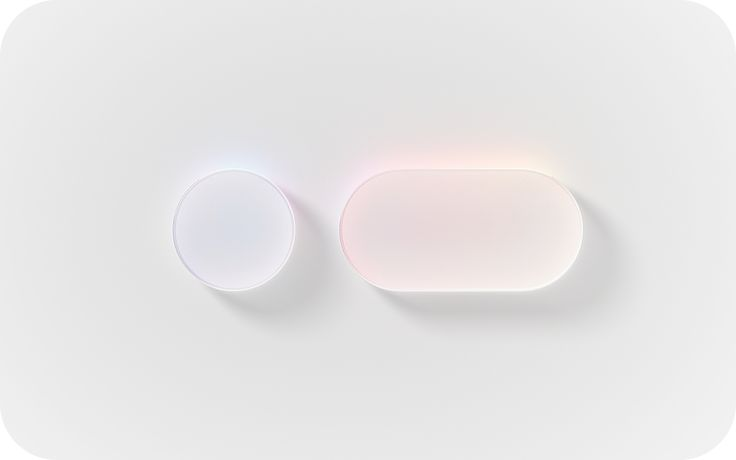
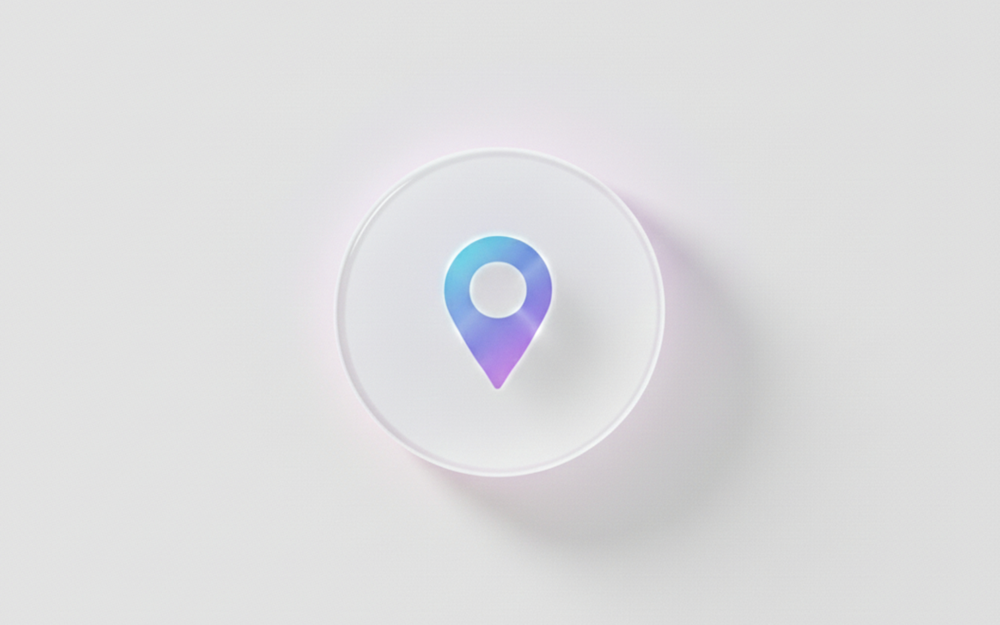
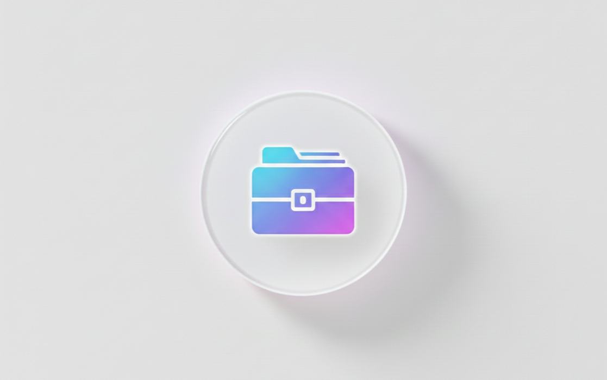

  

 

  
  
  
  
  
  

  

ʏᴀʜᴇʟʟᴏᴡ! ɪᴛ'ꜱ ᴀ ᴘʟᴇᴀꜱᴜʀᴇ ᴛᴏ ᴍᴇᴇᴛ ʏᴏᴜ. <b style="color: #800020;">ɪ'ᴍ ɢᴀᴜʀᴀᴠ</b>, ᴀ ꜱᴏꜰᴛᴡᴀʀᴇ ᴅᴇᴠᴇʟᴏᴘᴇʀ ʟᴇᴠᴇʀᴀɢɪɴɢ ᴄ++, ᴘʏᴛʜᴏɴ, ꜱᴡɪꜰᴛ, ꜱQʟ, ʀ, ʀᴜꜱᴛ, ʀᴇᴀᴄᴛ ᴀɴᴅ ʀᴇᴀᴄᴛ ɴᴀᴛɪᴠᴇ ᴛᴏ ᴇɴɢɪɴᴇᴇʀ ʜɪɢʜ-ɪɴᴛᴇɢʀɪᴛʏ ᴏᴘᴇʀᴀᴛɪɴɢ ꜱʏꜱᴛᴇᴍꜱ.

## 

  
 ᴀʙᴏᴜᴛ ᴍᴇ

- 🔭 ꜰɪɴᴅɪɴɢ ɴᴇᴡ ᴘᴀᴛʜꜱ ᴛᴏ ʀᴇᴄᴏɴɴᴇᴄᴛ ᴍʏꜱᴇʟꜰ  
- 📔 ɪ’ᴍ ᴄᴜʀʀᴇɴᴛʟʏ ʟᴇᴀʀɴɪɴɢ **ᴇᴠᴇʀʏᴛʜɪɴɢ ɪ ᴄᴀɴ ɢᴇᴛ ᴍʏ ʜᴀɴᴅꜱ ᴏɴ**  
- 👨‍💻 ᴀʟʟ ᴏꜰ ᴍʏ ᴘʀᴏᴊᴇᴄᴛꜱ ᴀʀᴇ ᴀᴠᴀɪʟᴀʙʟᴇ ᴀᴛ [ɢʀᴠᴜᴀ](https://github.com/gauravkangale)  
- 📨 ᴄᴏɴɴᴇᴄᴛ ᴡɪᴛʜ **writtenby.grvua@gmail.com**

  

  
ᴄᴏᴜʀꜱᴇꜱ ᴏᴠᴇʀ ᴡɪᴛʜ

- 🎗️

  

    
ᴜɴɪᴠᴇʀꜱɪᴛʏ ᴄᴏᴜʀꜱᴇꜱ

    - ɪɴᴛʀᴏᴅᴜᴄᴛɪᴏɴ ᴛᴏ ɪɴᴛᴇʀɴᴇᴛ ᴏꜰ ᴛʜɪɴɢꜱ - ꜱᴛᴀɴꜰᴏʀᴅ ᴜɴɪᴠᴇʀꜱɪᴛʏ  
    - ᴇʟᴇᴍᴇɴᴛꜱ ᴏꜰ ᴀɪ - ᴜɴɪᴠᴇʀꜱɪᴛʏ ᴏꜰ ʜᴇʟꜱɪɴᴋɪ  

  

  

    
ᴍᴇᴛᴀ ɪᴏꜱ ᴅᴇᴠᴇʟᴏᴘᴇʀ

    - ɪɴᴛʀᴏᴅᴜᴄᴛɪᴏɴ ᴛᴏ ɪᴏꜱ ᴍᴏʙɪʟᴇ ᴀᴘᴘ ᴅᴇᴠᴇʟᴏᴘᴍᴇɴᴛ  
    - ᴠᴇʀꜱɪᴏɴ ᴄᴏɴᴛʀᴏʟ (ɢɪᴛ & ɢɪᴛʜᴜʙ)  
    - ꜱᴡɪꜰᴛ ᴘʀᴏɢʀᴀᴍᴍɪɴɢ ꜰᴜɴᴅᴀᴍᴇɴᴛᴀʟꜱ  
    - ᴜx/ᴜɪ ᴅᴇꜱɪɢɴ ᴘʀɪɴᴄɪᴘʟᴇꜱ  
    - ʙᴜɪʟᴅɪɴɢ ɪɴᴛᴇʀꜰᴀᴄᴇꜱ ᴡɪᴛʜ ꜱᴡɪꜰᴛᴜɪ  
    - ᴀᴅᴠᴀɴᴄᴇᴅ ꜱᴡɪꜰᴛ ᴘʀᴏɢʀᴀᴍᴍɪɴɢ  
    - ᴡᴏʀᴋɪɴɢ ᴡɪᴛʜ ᴅᴀᴛᴀ ɪɴ ɪᴏꜱ  
    - ᴍᴏʙɪʟᴇ ᴀᴘᴘ ᴅᴇᴠᴇʟᴏᴘᴍᴇɴᴛ ᴡɪᴛʜ ᴊᴀᴠᴀꜱᴄʀɪᴘᴛ  
    - ʀᴇᴀᴄᴛ ʙᴀꜱɪᴄꜱ & ʀᴇᴀᴄᴛ ɴᴀᴛɪᴠᴇ  
    - ɪᴏꜱ ᴀᴘᴘ ᴄᴀᴘꜱᴛᴏɴᴇ ᴘʀᴏᴊᴇᴄᴛ  
    - ᴄᴏᴅɪɴɢ ɪɴᴛᴇʀᴠɪᴇᴡ ᴘʀᴇᴘᴀʀᴀᴛɪᴏɴ  

  

  

    
ɢᴏᴏɢʟᴇ ᴅᴀᴛᴀ ᴀɴᴀʟʏᴛɪᴄꜱ

    - ᴅᴀᴛᴀ ꜰᴏᴜɴᴅᴀᴛɪᴏɴꜱ: ᴅᴀᴛᴀ ᴇᴠᴇʀʏᴡʜᴇʀᴇ  
    - ᴀꜱᴋɪɴɢ ʀɪɢʜᴛ Qᴜᴇꜱᴛɪᴏɴꜱ ꜰᴏʀ ᴀɴᴀʟʏꜱɪꜱ  
    - ᴅᴀᴛᴀ ᴄʟᴇᴀɴɪɴɢ & ᴘʀᴇᴘᴀʀᴀᴛɪᴏɴ  
    - ᴅᴀᴛᴀ ᴀɴᴀʟʏꜱɪꜱ ꜰᴏʀ ᴅᴇᴄɪꜱɪᴏɴ ᴍᴀᴋɪɴɢ  
    - ᴠɪꜱᴜᴀʟɪᴢᴀᴛɪᴏɴ & ꜱᴛᴏʀʏᴛᴇʟʟɪɴɢ  
    - ʀ ᴘʀᴏɢʀᴀᴍᴍɪɴɢ ꜰᴏʀ ᴀɴᴀʟʏᴛɪᴄꜱ  
    - ᴄᴀᴘꜱᴛᴏɴᴇ ᴘʀᴏᴊᴇᴄᴛ (ʀᴇᴀʟ ᴄᴀꜱᴇ ꜱᴛᴜᴅʏ)  
    - ᴀɪ ᴛᴏ ᴀᴄᴄᴇʟᴇʀᴀᴛᴇ ᴊᴏʙ ꜱᴇᴀʀᴄʜ  

  

  

    
ᴀᴅᴠᴀɴᴄᴇᴅ ᴅᴀᴛᴀ ᴀɴᴀʟʏᴛɪᴄꜱ

    - ᴀᴅᴠᴀɴᴄᴇᴅ ᴅᴀᴛᴀ ᴘʀᴏᴄᴇꜱꜱɪɴɢ  
    - ᴅᴀᴛᴀ ᴄʟᴇᴀɴɪɴɢ ᴛᴇᴄʜɴɪǫᴜᴇꜱ  
    - ᴀᴅᴠᴀɴᴄᴇᴅ ᴀɴᴀʟʏᴛɪᴄᴀʟ ᴍᴇᴛʜᴏᴅꜱ  
    - ᴘʀᴏ ꜱᴛᴏʀʏᴛᴇʟʟɪɴɢ ᴛᴇᴄʜɴɪǫᴜᴇꜱ  
    - ᴄᴀꜱᴇ ꜱᴛᴜᴅʏ ᴍᴀꜱᴛᴇʀʏ  

  

  

    
ᴀɪ ᴘʀᴏɢʀᴀᴍꜱ

    - ɢᴇɴᴇʀᴀᴛɪᴠᴇ ᴀɪ ʟᴇᴀᴅᴇʀ - ɢᴏᴏɢʟᴇ  
    - ᴀɪ ꜰᴏᴜɴᴅᴀᴛɪᴏɴꜱ ꜰʀᴏᴍ ᴏxꜰᴏʀᴅ  
    - ɴᴠɪᴅɪᴀ ᴀɪ ɪɴꜰʀᴀꜱᴛʀᴜᴄᴛᴜʀᴇ  
    - ɪʙᴍ ɢᴇɴᴇʀᴀᴛɪᴠᴇ ᴀɪ ᴇɴɢɪɴᴇᴇʀɪɴɢ  
    - ᴍɪᴄʀᴏꜱᴏꜰᴛ ᴀɪ ᴘʀᴏᴅᴜᴄᴛ ᴍᴀɴᴀɢᴇᴍᴇɴᴛ  

  

  

    
ᴏᴛʜᴇʀ ᴄᴏᴜʀꜱᴇꜱ

    - ʀᴜꜱᴛ ᴘʀᴏɢʀᴀᴍᴍɪɴɢ - ᴄᴏᴅᴇ ꜱɪɢɴᴀʟ  
    - ᴅꜱᴀ ɪɴ ᴄ++ - ᴅᴀᴛᴀ ꜰʟᴀɪʀ  
    - ᴅᴀᴛᴀ ꜱᴛʀᴜᴄᴛᴜʀᴇꜱ ɪɴ ᴄ++ - ꜱᴄᴀʟᴇʀ  
    - ᴄ++ ʙᴇɢɪɴɴᴇʀ ᴄᴏᴜʀꜱᴇ - ꜱᴄʜᴏʟᴀʀʜᴀᴛ  
    - ᴘʏᴛʜᴏɴ ʙᴇɢɪɴɴᴇʀ ᴄᴏᴜʀꜱᴇ - ꜱᴄʜᴏʟᴀʀʜᴀᴛ  
    - ʀᴜꜱᴛ ɢᴇᴛᴛɪɴɢ ꜱᴛᴀʀᴛᴇᴅ - ʟɪɴᴜx ꜰᴏᴜɴᴅᴀᴛɪᴏɴ  

  

  

## 

 

  
    ━⋅•⋅⊰∙ʚ˚̣̣̣͙ɞ・ᴅᴇᴠᴇʟᴏᴘᴇᴍᴇɴᴛ & ᴘʀᴏᴅᴜᴄᴛɪᴠᴇ ᴛᴏᴏʟꜱ・ ʚ˚̣̣̣͙ɞ∙⊱⋅•⋅━
  

   
  

    
    
    
    
    
    
    
    
    
    
    
    
    
    
    
    
    
    
    
    
    
    
    
    
    
    
    
    
    
    
    
    
    
    
    
    
    
    
    
    
    
    
    
    
    
    
    
    
    
    
    
    
    
    
    
    
    
    
    
    
    
  

   
   

  
    ━⋅•⋅⊰∙ʚ˚̣̣̣͙ɞ・ᴄᴜʀᴀᴛᴇᴅ ᴡᴏʀᴋ ᴀɴᴅ ᴘʀᴏᴊᴇᴄᴛꜱ・ ʚ˚̣̣̣͙ɞ∙⊱⋅•⋅━
  

<table>
<tr>
<td width="33%">

 <b style="color: #800020;">Qʟɪɴ</b>
</td>

<td width="33%">

 <b style="color: #800020;">ʀᴀᴄᴛ</b>
</td>

<td width="33%">

 <b style="color: #800020;">ᴘᴏʀᴛꜰᴏʟɪᴏ</b>
</td>
</tr>
</table>

 
 

  
    ━⋅•⋅⊰∙ʚ˚̣̣̣͙ɞ・ɢɪᴛʜᴜʙ ꜱᴛᴀᴛꜱ・ ʚ˚̣̣̣͙ɞ∙⊱⋅•⋅━
  

 
 

  
    ━⋅•⋅⊰∙ʚ˚̣̣̣͙ɞ・❦・ ʚ˚̣̣̣͙ɞ∙⊱⋅•⋅━
  

 

  
  

  

##

  
  

  

 

  
    ≿━━━━༺❀༻━━━━≾
  

